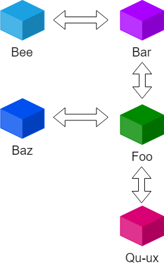

# Alien Invasion!
An exercise in Go to simulate a mad alien invasion.

> All your base are belong to us.
> 
> ---  *Cats*


## Todo
Alien Invasion is work in progress. Notable items missing:
1. Map file reader
2. Command parser
3. Alien names
4. Graph visualization?

## Installation and usage
Create a map file and run the simulation:
```
go install
./bin/invade MAPFILE [-n ALIENS]
```

## Rules
1. Aliens start out at random cities.
2. Aliens wander around randomly following roads between cities. Each iteration, aliens can travel in any of the roads leading out of a city.
3. When two aliens end up in teh same place they fight, killing each other and destroying the city and any roads in and out of it.
4. Simulation ends once one of the conditions has been reached:  
    1. No more aliens in the simulation
    2. Each alien has reached 10,000 moves

## Map files
Define a map as a text file with a line for each city.
Cities can have a neighbouring city in any cardinal direction, north, east, south and west.

### Map file syntax: 
```
NAME [north=NAME] [east=NAME] [south=NAME] [west=NAME]
```

### Example:
Define a map with 4 cities:  
```
Foo north=Bar west=Baz south=Qu-ux
Bar south=Foo west=Bee
```    


## Open questions and assumptions

### 1. No routes by implication

If cities are defined neighbours by implication only (i.e. defined as neighbours by their neighbours but not directly by themselves), there is no route between them.  


Example: Helsinki has no route to Tallinn despite being direct neighbours by implication.  

```
Helsinki east=Vyborg
Vyborg south=St.Petersburg west=Helsinki
St.Petersburg north=Vyborg east=Tallinn
Tallinn east=St.Petersburg
```


### 2. Fights happend at end of turn.  

Example: If Puckmarin is currently in Tokyo and Adipose in Beijing, and Adipose starts the turn by moving to Beijing, the fight isn't immediately triggered as Puckmarin will move away on its own turn. Only if two aliens inhabit the same location after everyone has moved do fights occur.
